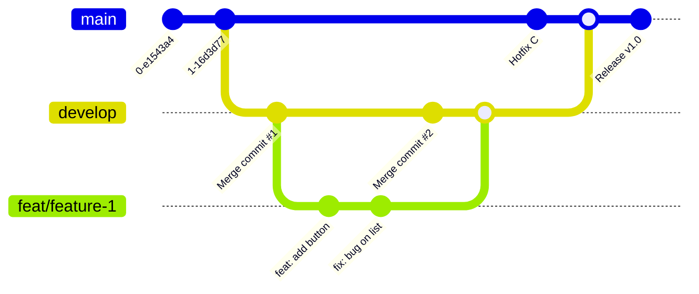

# Workflow

To work on something in one of the following repo, you need to follow this pattern so release and changes are staged accordingly :&#x20;

* `app`
* `backend`

We use 2 branches to stage and release changes

* `main` : contains code in production / releasing to the Store
* `dev` : contains the latest changes that are waiting for a release

## How to contribute ?

* fork the `dev`  branch
* make a branch from your `dev` fork, while following the convention : feat/..., fix/..., chore/...
* make a PR from your fork work branch to the repo dev branch
* wait for approval / feedback
* branch is merged, change staged for release

Here's a "real world" example on how a feature would be developed :

## Versioning

We use semantic release to determine version bump for the commit that is merged to main.

Bump only happens inside the `main` branch.
