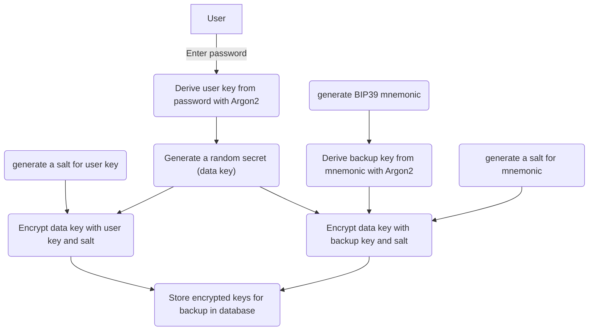

# Encryption

## Overview

Atomic Blend supports end-to-end encryption, which means that nor us, your ISP, or any cloud provider can access and read your data.&#x20;

Your data is encrypted securely using a derivation of your password to encrypt a data key, which will be used to encrypt all your data.

A mnemonic key is also generated and encrypt the data key to allow you to recover your data in case you loose your password.

## Concept

## Algorithms

* Argon2 to derive password / mnemonic to a key
* AES-GCM, with a 256 bits key&#x20;

## Data models

You can find the details of the models, what's encrypted or not, here : [Models](https://app.gitbook.com/s/dxKeXEgHqpeFIV8n9WBU/models "mention")
