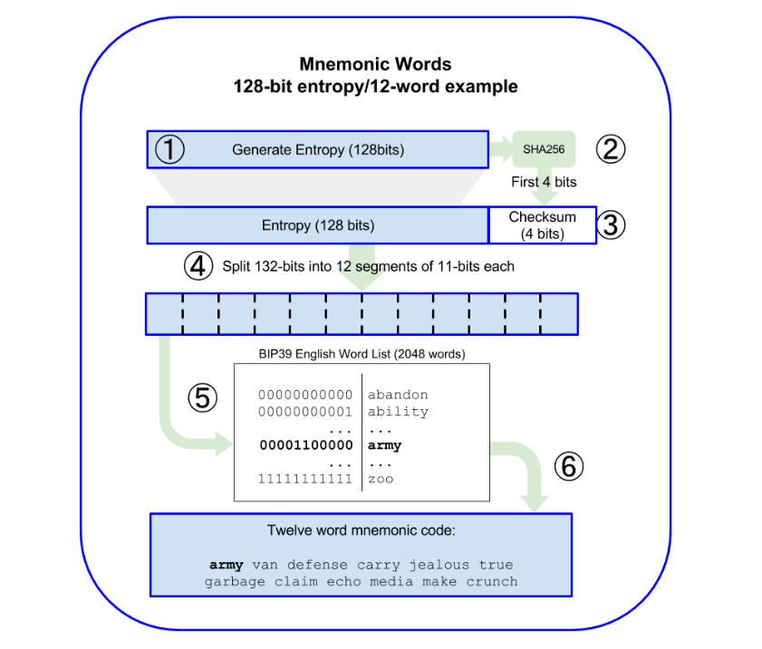

# Mnemonic

## Overview

To allow you to have a backup key, and help you recover your data if you loose your password, we've implemented a BIP39 Mnemonic key, the same as a Bitcoin Wallet that you will have to store somewhere in case you need it.

## BIP 39

Here are some illustrations explaining how a BIP 39 Mnemonic works :&#x20;

<figure><figcaption>
Source:  <a href="https://rads.stackoverflow.com/amzn/click/com/1491954388">Mastering bitcoin</a>
</figcaption></figure>

<figure><figcaption>
Source:  <a href="https://rads.stackoverflow.com/amzn/click/com/1491954388">Mastering bitcoin</a>
</figcaption></figure>

_Note: in our case, the 512-bit Seed is in fact our 256-bits AES-GCM key_
