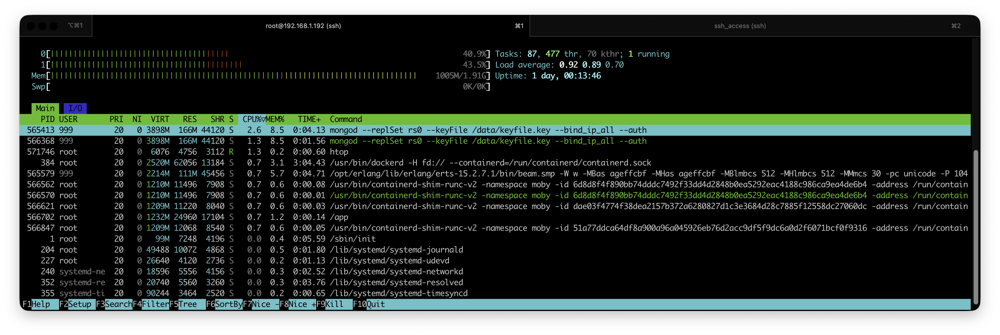

# Getting Started

Atomic Blend is made to be self-hosted, and a docker-compose file is supplied as well as a `.env`  example for configuration.

## Requirements

Atomic Blend have been tested on a small 2vCPU and 2Go of RAM VM in my own Proxmox cluster using docker.
Here's a screenshot of the consumption at rest on those specs:

## Hosting methods

* [docker-compose](https://app.gitbook.com/o/x8k6BaS4vsRQi6jhJbPa/s/hHvz6ggkRjTblbaIVu0l/~/changes/6/self-hosting-1/getting-started/docker-compose)

## Caveats

* When self-hosting and using the Store available version of the app, you will not able to get notifications (for now, until a public relay is implemented)
